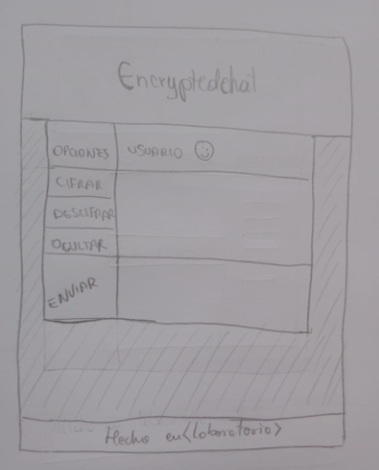
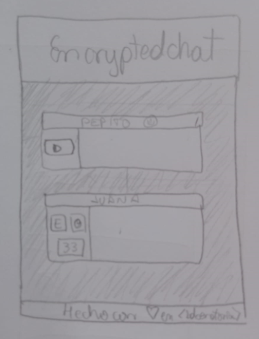
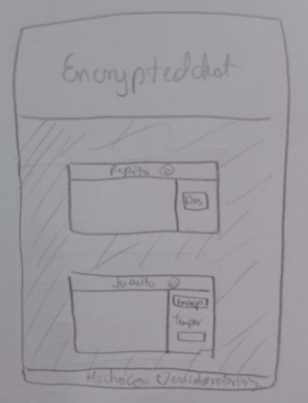
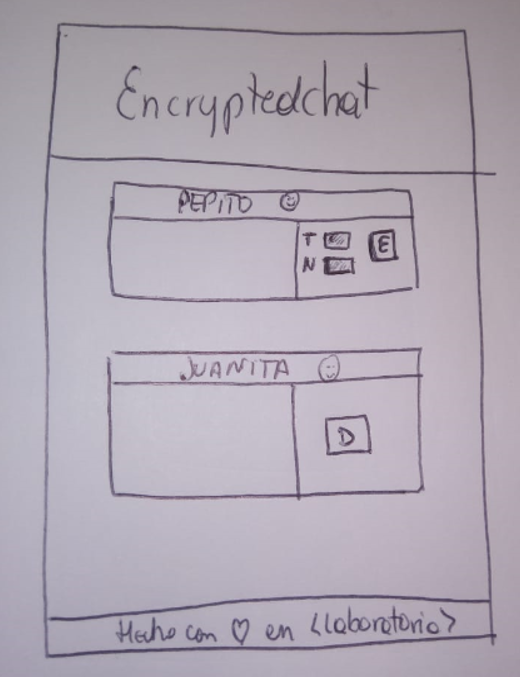

# CIFRADO CESAR PROJECT

## DEFINICIÓN DEL PRODUCTO

**Solicitud del usuario: Crea una web en la que puedas introducir una frase del usuario y que mediante el cifrado cesar devuelva el mismo mensaje encriptado**

*EncryptedChat es una web desarrollada pensando en las personas que quieren mentener sus conversaviones en privado, mediante un código que pueda cifrar mensajes para que al enviarlos, solo el receptor pueda decifrarlos haciendo uso de la mimsa web*

## EXPERIENCIA DEL USUARIO

1. Investigación del usuario: En esta etapa realicé preguntas a amigos que tenía una relación y que eran potenciales usuarios de esta web. 
2. Análisis: En esta etapa entendí que la necesidad de las personas es su deseo de mantener solo unas específicas conversaciones por privado, más no todo su chat.
3. Diseño: En esta etapa idee una primera versión de lo que creía que el usuario necesitaba.

Al presentarla a diferentes personas y recibir feedbacks, identifiqué los siguientes modelos.

 
 

 

4. Prototipo: luego de constantes feedbacks, materialicé la solución que más se acercaba a la del usuario.

**Entonces ¿quiénes son los principales usuarios de producto?** 

Como se mencionó líneas arriba, los principales usuarios del producto son aquellas personas que desean mantener conversaciones privadas específicas; para organizar algún evento sin que el agasajado se entere, para mantener una cita privada, o que sus hijos/padres no entiendan sus mensajes.

**Y ¿cuáles son los objetivos de estos usuarios en relación con el producto?**

Los objetivos de los usuarios de EncrytedChat son cifrar y decifrar mensajes mediante la web, para mantener conversaciones privadas en otras apps pero que solo los que interactúan puedan entender.

**¿cómo crees que el producto que estás creando les está resolviendo sus problemas?**

El producto desarrollado resuelve el problema de privacidad, implementando un sistema de mensajes codificados que solo sus usuarios entienden.

## FUNCIONALIDAD 

Para poder resolver el reto se siguieron estos pasos:
 
1. Se inserta una letra o palabra (**word**). 
2. Se inserta un código numérico (**offset**).
3. Se decide si cifrar o decifrar el mensaje.

   3.1. Si se elige la opción (**cifrar**),se ejecuta la fórmula:
   (**String.fromCharCode((word - 65 + offset)%26 + 65)**) para mayúsculas,
   o (**String.fromCharCode((word - 97 + offset)%26 + 97)**) para minúsculas.

   3.2. Si se elige la opción (**decifrar**), se ejecuta la fórmula:
   (**String.fromCharCode(((wordD-65)+(26-(offset%26)))%26+65)**) para mayúsculas,
   o (**String.fromCharCode(((wordD-97)+(26-(offset%26)))%26+97)**) para minúsculas.

4. Si el ususario ingresa algo diferente a lo solicitado en el cuadros de texto,
   aparecerá un mensaje de alerta para que lo corrija.
5. Se recibirá el mensaje cifrado o decifrado según lo haya solicitado.

veamos los procesos: 

**Mensaje cifrado**

**Mensaje decifrado**

**Mensaje de error** 

## DOCUMENTOS

El proyecto, dentro de la carpeta src, contiene los siguientes archivos:

**readme.md** : donde se explica textualmente el proyecto.

**index.html** : donde se encuentra la estructura de la web.

**style.css** : donde observamos los estilos de la web.

**cipher.js** : donde se desarrolla la funcionalidad de la web.

**index.js** : donde se escucha los eventos del DOM.